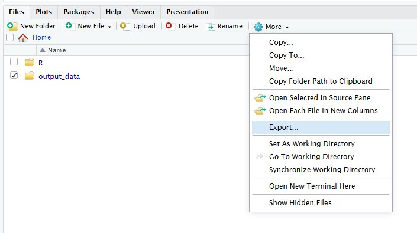

# NOAA Fisheries Cloud Computing Setup

This repository details cloud computing resources at NOAA Fisheries, with a focus on Google Cloud Workstations for R users. Please see the [Openscapes Fall 2025 Cohort's Cloud Clinic](https://gamma.app/docs/Cloud-Clinic-361wjiw6rh2pw2m?mode=doc) for foundational information on cloud data and computing.

## Why Cloud?

All [NOAA datasets must be uploaded in the cloud by 2026](https://docs.google.com/presentation/d/18cwiB2f2rVlX3RJIsIB0iaD9u2bMdblZCS8RYcrGDd0/edit?slide=id.p1#slide=id.p1), and all on-premises computing resources for NOAA Fisheries are planned to be retired by 2027. Working entirely in the cloud allows scientists to make workflows more efficient, without losing time to downloading/uploading. With the transition timeline away from existing resources, we have compiled documentation here to share and allow scientists who previously worked on uber computers to adapt their workflows more quickly.

The Google Cloud Workstations are super/uber computers in the cloud, or online, instead of physically housed at a NMFS facility. When running code that might take hours or days, a workstation can do the job while you retain full functionality of your local PC. Any work that previously required the uber computers or multiple PCs should be transitioned to the cloud.

## NOAA Fisheries Cloud Program

[NOAA Fisheries Cloud Program](https://docs.google.com/document/d/1nziPdPULoRWOYQ9WKzISNUgJvANACvfYpFr1z3Ro2Bc/edit?tab=t.0) began a Cloud Compute Accelerator Pilot in early 2025: [Enhancing NOAA Fisheries’ Mission with Google Cloud Workstations](https://docs.google.com/document/d/1u7R5KjfEDYdwYTvO9kU6EyeHfG7dV9TQizIyCn8seO0/edit?tab=t.0). Following the conclusion of this Pilot Program, they compiled [Frequently Asked Questions](https://docs.google.com/document/d/1U1PzGS7G70xsXtD6F6WxkjTSCw7bwNVyZ-YnFyOLOqU/edit?tab=t.0) for pilot participants and new users.

### Terminology and Definitions

Terminology used throughout this tutorial are defined below.

| Term | Definition |
|------------------------------------|------------------------------------|
| Workstation | Pre-configured virtual machines listed under “My Workstations” available on NOAA's Google Cloud. |
| Configuration | The default settings of the workstation including: type (Base, RStudio, Python, posit), and storage/processing size (small, medium, large). |
| Session | An active portion of the workstation, shares storage and power. It is possible to partition a workstation into multiple sessions with different IDEs and core usage. |
| Data Bucket | Cloud-based object storage drive that is optimized for code and external to the workstation. |

### Requesting a Google Cloud Workstation

The NOAA Fisheries Cloud Program grants access to Google Cloud Workstations upon request by filling out the following [form](https://docs.google.com/forms/d/e/1FAIpQLSc-RSmPhLV7kBuiiuAzxb2LvWG7Q6XrNbQCbhJZtvaVVtOVZQ/viewform).

## Setting up a Google Cloud Workstation

A Google Cloud Workstation is a virtual machine (VM) that can be customized to mimic any computing environment. The VM is hosted in the cloud and incurs long-term storage costs whether it is in use or not. Ultimately, workstations are designed to be spun up, used, and deleted regularly. Think of workstations as disposable computers, you should strive to get the perfect fit for your purpose, use it, then discard it, with your entire process immortalized on GitHub and your inputs/outputs persisting on cloud storage.

### Selecting the right size workstation

The IDE or program you use to run your code will decide which workstation type you choose (Base, Code OSS, Python, R, Posit Workbench). This section focuses on which size you should choose. High resource users, please see [Fisheries Cloud Program Section 4.0 High-Performance and Custom Workstations (FMC-Funded Option)](https://docs.google.com/document/d/1nziPdPULoRWOYQ9WKzISNUgJvANACvfYpFr1z3Ro2Bc/edit?tab=t.0#heading=h.65j2qoyirqa8): "The enterprise offering is designed to cover standard analytical needs. If your work requires high-cost, specialized resources, such as GPUs, larger machine types (beyond Large), or custom-developed images for specific program workflows, these resources are available, and treated as independent GCP projects, and billed according to the annual GCP cost recovery process."

As with previous uber computer work, code should be written and troubleshooted locally before being executed in a workstation. During the troubleshooting process, you should get an idea of what storage and processing requirements you may have via benchmarking. For many processes, a workstation does not need to be a perfect fit, but below are some simple methods for benchmarking your work to better understand which size workstation you should select.

#### Benchmarking Storage Space

The workstation you select will need enough storage to hold all of your inputs, outputs, and temporary files generated during processing. The NOAA Fisheries Cloud Program provides workstations with 10 GB, 50 GB, and 100 GB worth of disk space. You must consider if your process will fit within 100 GB before using a workstation.

Since storage usage scales consistently, you can calculate the total output data by multiplying one unit of output data by however many iterations of code you plan on running. Add that to the total input data, and you know the minimum storage requirements of your process.

If your storage minimum is higher than the "large" workstation configuration (100 GB) then you will need to offload/delete data during the process, use a Google Bucket (see below), or request a custom configuration.

#### Benchmarking Processing Power

The processing power required for a process is more complex than storage space because some code scales with additional CPU and RAM. There are a few key questions you should ask when choosing processing power:

1.  Does the code run in parallel?

    If no, "small" will probably meet your needs unless your code is RAM or storage intensive.

    If yes, select the machine based on how many threads can it use simultaneously.

2.  How long does the process take, and would upgrading improve that time?

    Using the "Wall-Clock" method, you can measure how long 1 iteration takes (`r R:Sys.time()`) and extrapolate that out to however many iterations you plan on running. If your code runs in parallel and improves with additional cores/RAM and you need the results as soon as possible, use the largest machine.

3.  How RAM intensive is the code?

    If your code maxes out the RAM on your local machine, it may be worth it to benchmark your code to better understand how much RAM you will need on a workstation. The R `bench` package or Python `pyperf` can be used to calculate the RAM required.

When in doubt, you can start with the smallest workstation for additional troubleshooting and upgrade as needed.

## Using a Workstation

**BACK UP YOUR WORK** and use the cloud workstations to run existing scripts, not to develop code. Hourly compute costs are incurred when the workstation has been "Started", so ensure that each workstation is "Stopped" when runs are complete and the computing session is no longer in use. Be aware that these workstations automatically delete after 6 months of no use to avoid long term storage costs. The optimal workflow for a workstation is to have a GitHub repository with all the necessary code to run your process. Thus, the first step when opening a workstation should be connecting to GitHub.

### Linking Workstation to GitHub

The quickest and most persistent method for linking a workstation to a Github Enterprise Account is with a Personal Access Token (PAT). This can be done by reading the instructions and executing the code in [R/github_setup.R](https://github.com/nmfs-opensci/CloudComputingSetup/blob/main/R/github_setup.R). Before executing the script you will need to generate a PAT, bellow are relevant PAT documentation (also linked in script):

1.  [GitHub PAT Settings](https://github.com/settings/tokens)
2.  [GitHub PAT Tutorial](https://docs.github.com/en/authentication/keeping-your-account-and-data-secure/managing-your-personal-access-tokens)
3.  [NMFS GitHub Governance Authentication Tutorial Video](https://drive.google.com/file/d/1tbbw_xXARK689Zj5tm4lVo18aBaXhdKX/view?t=4) (Requires NOAA Google Drive access)

Workstations will remain linked to GitHub until the PAT expires and persists even if the workstation is shutdown. Once the link is made to your GitHub repository, you can push and pull changes as you would from any other machine.

#### Additional Notes on PATs

[Personal access tokens (classic)](https://docs.github.com/en/authentication/keeping-your-account-and-data-secure/managing-your-personal-access-tokens#personal-access-tokens-classic) are less secure. However, classic tokens can be used across multiple repositories and are simpler to setup. If you are a beginner using PATs, we recommend generating a classic token with only 'repo' access granted in the scope.

PATs should be set to expire in 90 days. 'Configure SSO' needs to be set to 'Authorize' access to your Enterprise organization if applicable, e.g. SEFSC.

### Customizing Your Configuration

Code generally requires a specific computing environment to work properly, this is especially important when treating workstations as temporary machines. Below are some best practices for ensuring your environment is set-up before running your code.

We have provided 2 examples for installing packages. The [easy package install](https://github.com/nmfs-opensci/CloudComputingSetup/blob/main/R/package_install_easy.R) example lists typical install.package() functions with a few specialized lines for installing specific versions of packages. For simple scripts with limited package installations, this is an easy way to maintain scripts for new users. The [intermediate package install](https://github.com/nmfs-opensci/CloudComputingSetup/blob/main/R/package_install_intermediate.R) example has the basic commands required for building, restoring, and maintaining a R:renv environment. This R package saves your R package environment as a renv.lock file which can be stored in github and used to create the same environment on any machine. This method works will if your processes require a lot of packages with specific versions but it can be trickier to get working and maintain. Both examples include the RStudio fix described below and create files for input and output data that can serve as bucket mount points.

#### RStudio

By default the RStudio configuration will attempt to download packages via source code instead of binary through the posit package manager which drastically slows the installation progress down. Before starting any installations use the following code to source binary:

```{r}
repo_line <- 'options(repos = c(CRAN = "https://packagemanager.posit.co/cran/__linux__/jammy/latest"))'
writeLines(repo_line, "~/.Rprofile")
# Restart R session to lock in Rprofile changes
# Session -> Restart R or Ctrl+Shift+F10
```

You must restart the RStudio's R session before you install any packages. This should allow your workstation to install packages just as fast as a Posit configuration.

#### Posit

The Posit configuration is the easiest environment to set-up, whether you are using the Positron or RStudio IDE. Since Posit uses the posit package manager by default, any packages you install via install.packages() should install quickly and easily. When installing the first package you will be prompted to create a personal folder for the packages to be stored in home/user, you should type "yes" twice and that will ensure that your packages will persist between opening and closing the workstation.

### Uploading Data

There are a few options for getting your data onto a workstation we would recommend manually moving the data or mounting a Google Cloud Bucket (see below). If your data is small enough, you can use the IDE's manual upload methods. Positron: files can be dragged from your local PC and dropped into the VM environment. RStudio: The file management panel in the bottom right has data uploading options including uploading entire folders as a .zip and automatically extracting them into the VM directory.

The main workstation directory that is persistent across sessions is \~/home/user. Your github repositories should be housed here and input data locations will depend on how you've set up your repository.

### Cloning Your Workstation

Best Practices for configuring workstations is still in development. A current strategy for repeated similar runs includes cloning your workstation. This solution involves an underlying workstation storage cost (cheaper than run times, but still cost inefficient). Ideally, we would have workstation templates that require minimal additional configurations, avoiding this burden and associated storage cost. Base workstations for cloning should be utilized short term and should only be stored if you're running repeated similar tasks at the same time. All workstations (including the base) should be deleted when the task is completed.

### Running Code

In workstations, a key benefit is being able to start code running and walk away until it finishes. You do this by running your code in the Posit Workbench or R Background Jobs. This means you need to build your scripts in such a way that no user interaction is required (i.e. confirmations y/n or authentication). Any authentication or package installation should be done with you actively there, then you can run your totally independent code.

### Downloading Data

When your run is complete, best practices would be to produce your output reports in the cloud as well, using quarto documents stored on Github. But if you need to download data from a workstation you can manually download it with the IDE's manual download methods.

**Positron**: right click on the file and download it, positron will then prompt you to choose the file you want to download it to. There will be a moving blue bar above the file explorer that will stop moving when the download is complete.

{width="326"}

**RStudio**: press the check-mark box next to a file and press the cog drop down to select download. This will compress the file and download it as a zip. This will open a new blank browser while it downloads, when the download is finished the window will close itself and the browser will show the file in your downloads.

{width="522"}

## Requesting a Google Data Bucket

Work through local IT to obtain a data bucket **in the us-east4** region. Permissions to read and write to these data buckets can only be granted through IT admin. Reference existing [documentation about servers vs objects](https://nmfs-opensci.github.io/EDMW-EarthData-Workshop-2025/content/why-cloud.html) for additional information on Google shared drive vs data buckets and relative speed. Currently, there is no existing link between Google Shared Drive and Google Cloud Workstations.

Existing public NOAA data buckets can be found [here](https://www.noaa.gov/nodd/datasets#NMFS) for reference as to what these data buckets look like in the web interface. Instructions provided here are for use cases where the user has both read and write access to the data bucket being mounted, but mounting a public database should work similarly (sans write access).

Note, the Google Workstations are in the us-east4 region. It is important that your Google Bucket is in the same region so that there are no data movement changes. If your bucket is not in Google region us-east4, there is a data movement charge both to OCIO and to your local FMC. Your FMC will be charged egress charges for any data that is downloaded to or read into the workstation and OCIO gets charged for data going from the workstation in us-east4 to a bucket in another Google region (not us-east4). Cost is about $0.02/Gb for both ingress and egress. Note this is true for public buckets like NOAA NOAA buckets. You will pay to put data there if you are processing in a virtual machine; you will not pay if you process on your local computer and upload to Google Buckets.

## Linking Workstation to Bucket

Buckets need to be mounted each time a workstation is started and should persist across all sessions until the workstation is turned off. Mounting a bucket requires an active terminal (the tab next to the R console in RStudio and Positron). Copy and paste the [R/mount_bucket.R](https://github.com/nmfs-opensci/CloudComputingSetup/blob/main/R/mount_bucket.R) code directly in the terminal. [Please note that ctrl+v does not work for pasting into an R terminal; ctrl+shift+v or manually right click and select 'Paste'. ] The code is commented with instructions and can be pasted line by line or all at once.

The terminal will prompt you to authenticate your google account on [line 17](https://github.com/SEFSC/cloud_computing_SSMSE_starter/blob/0d3689835cd279d37bf01e47fe8b7ba8e426b485/mount_bucket.R#L17):

```{r}
gcloud auth application-default login --no-launch-browser
```

Follow the prompts to authenticate (including pasting the output from your browser directly into Terminal), then press enter or copy and paste the rest of the script in the R Terminal to continue the process. This is the most finicky and potentially user-specific step of the process. The remaining code will install or update `gcsfuse` on the workstation and mount the bucket. Once mounted a first time, lines 41-47 can be used to remount a bucket after a workstation is shutdown and skip the authentication/installation process.

*We'll need to change the bucket name to the public one that Eli plans to use for Openscapes/training purposes*

### Validating the Connection

From the code provided previously to mount a data bucket, we have named the bucket `my_gsc_bucket` and stick with this nomenclature throughout. If you are still working in the R Terminal, you can validate the connection using

`ls -l "$MOUNT_POINT"`

If you are working in a regular R Script or Console, you can check the contents of the bucket using

`list.files("~/my_gcs_bucket")`

Additionally, to view contents within subfolders, you can use

`list.files(path = "~/my_gcs_bucket/subfolder")`

Please note that within an RStudio cloud interface, the 'Files' GUI typically located in the lower right-hand corner may show an empty `$HOME/my_gsc_bucket` folder, but running the scripts above will verify if the data bucket has been successfully mounted.

### Reading from Buckets

Once the connection to the Data Bucket is made, you can run [R scripts](https://github.com/nmfs-opensci/CloudComputingSetup/blob/main/R/readwrite_databucket.R) as usual, pointing to the bucket location. For example,

`load('~/my_gcs_bucket/subfolder/sampdata1.RData')`

`data <- read.csv("~/my_gcs_bucket/subfolder/sampdata2.csv")`

both work to load an RData image and .csv file, respectively.

### Writing to Buckets

Writing to buckets works similarly. If the 'data' file above was cleaned on the Workstation and named 'data2' in R, this could be written directly to the workstation as 'sampdata2_clean.csv'.

`write.csv(data2,"~/my_gcs_bucket/subfolder/sampdata2_clean.csv")`

### Downloading from Buckets

Data can be downloaded to a local machine manually by opening the bucket in a browser, clicking download, and selecting the files you want to download.

If you are moving large amounts of data and need to automate the process, follow these instructions:

1.  You need to install the Google cloud CLI plus python on the machine you want to download the data on: <https://cloud.google.com/sdk/docs/install>

2.  Upon installation, the Google Cloud SDK will walk you through authenticating your Google account so it can access any buckets you have access to.

3.  It will prompt you to select a NMFS project.

4.  Use bash code i.e. `cd /d/User/my_name/my_file/` to navigate to the folder where you want the data to go.

5.  Then run with the path to the bucket file you want to download example:

 `gsutil -m cp -r "gs://name_of_bucket/file_within_bucket"`

### Best Practices

Best Practices are still under development. Authors are considering options such as defining 'cloud' file paths and 'local' file paths for reading and writing data that are called at the top of the scripts, allowing for minimal edits between programs that are run in the cloud and locally. Alternatively, programs could be written exclusively for cloud computing platforms or local computing.

Suggested ways to set up workflows to easily move between running locally and in the cloud if desired?

General Tips:

-   Code should be on Github.

-   Large data should be stored in Google Cloud Buckets.

-   R Projects can be saved as a Github Repositories and automatically set the working directory to the cloned repository on your local machine and workstation.

-   Use .gitignore on your "input" and "output" files but include code in your workstation starter to create "input" and "output" folders in the workstation so you can import your data or mount your bucket to the same location in your working directory every time.

-   Talk to your colleagues to see how they set up their scripts, start to use the same formats, and share github repositories.

-   Google Shared Drives cannot connect to Google Cloud Workstations currently. Any actively used data will need to be moved manually or to a Google Cloud Bucket.

## Alternative Options

If cloud computing resources are not necessary, alternative options include accessing data in the cloud with local computing resources. With Google Drive for Desktop, data on shared drives can be accessed using G:/ the same as we access shared drives on local computers. Alternatively, if cloud computing workstations have sufficient storage for the programs that you're running, it is not absolutely necessary to link to a data bucket.

## Acknowledgements

Resources shared by [Eli Holmes](https://github.com/eeholmes), [Jonathan Peake](https://github.com/jonpeake), Josh Lee, and Ed Rogers; authored by [Alex Norelli](https://github.com/norellia-NOAA) and [Molly Stevens](https://github.com/mollystevens-noaa).

### Disclaimer

This repository is a scientific product and is not official communication of the National Oceanic and Atmospheric Administration, or the United States Department of Commerce. All NOAA GitHub project content is provided on an ‘as is’ basis and the user assumes responsibility for its use. Any claims against the Department of Commerce or Department of Commerce bureaus stemming from the use of this GitHub project will be governed by all applicable Federal law. Any reference to specific commercial products, processes, or services by service mark, trademark, manufacturer, or otherwise, does not constitute or imply their endorsement, recommendation or favoring by the Department of Commerce. The Department of Commerce seal and logo, or the seal and logo of a DOC bureau, shall not be used in any manner to imply endorsement of any commercial product or activity by DOC or the United States Government.

### License

This content was created by U.S. Government employees as part of their official duties. This content is not subject to copyright in the United States (17 U.S.C. §105) and is in the public domain within the United States of America. Additionally, copyright is waived worldwide through the CC0 1.0 Universal public domain dedication.
