## Aims and Objectives

Many NMFS staff who will be using the Google Workstations platform require access to files and directories hosted on NOAA's Google Drive. During this session, we'll be covering the following topics to get you up and running with Google Workstations:

- Connecting workstations to Google Drive using RClone

- Direct access to Google Drive files and folders in R using the `googledrive` package

## Prerequisites: What do I need before this workshop to follow along on my own?

1.  This session is meant for those with a basic understanding of Google Workstations. Check out our [Introduction to Google Workstations](../intro/intro.qmd) lesson if you are new to Google Workstations or need a refresher.
2.  We will be working on the command line, so familiarity with command line tools and operations will be helpful for this workshop.

## Connecting to Google Drive using RClone

RClone is an application that provides a mountable folder of your Google Drive (and other cloud storage services) in your working directory, similar to the Google Drive for Desktop application available for Windows and Mac machines. However, unlike the Google Drive for Desktop application, RClone works in a Linux operating system, and thus will work on the Linux-based Google Workstations. Use the following steps to install and configure RClone. Note that this will work from the terminal of any of the current Workstation configurations, but for demonstration purposes I will use the RStudio workstation here.

1.  Create or launch an RStudio workstation in your Google Cloud Console\
    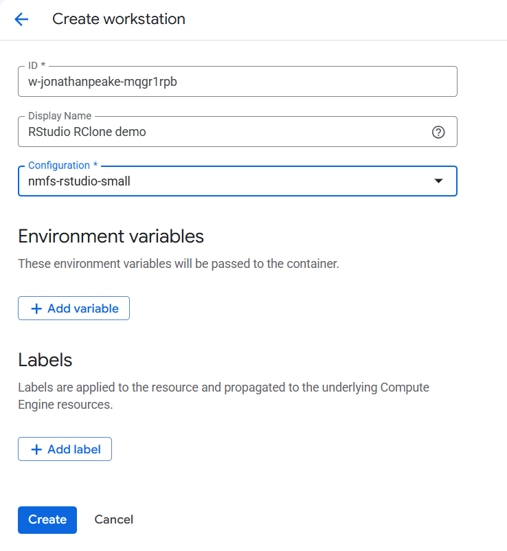

2.  In your workstation RStudio terminal, run the following script to set up RClone. This will start a configuration process in the terminal. After every prompt, be sure to hit `Enter` after you enter the appropriate response.

    ```         
    sudo apt update
    # NOTE:
    # The command below installs an older version of rclone,
    # which does NOT provide the config_token option later.
    sudo apt install fuse3 rclone
    # Install the latest version of rclone
    sudo curl https://rclone.org/install.sh | sudo bash
    mkdir ~/gdrive
    rclone config
    ```

    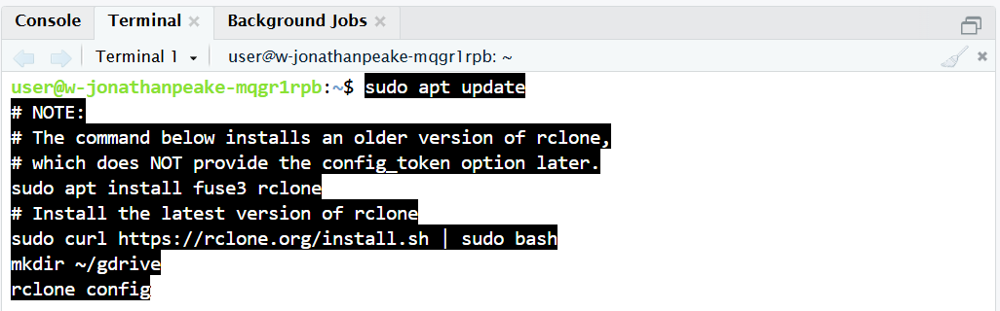

3.   When prompted, enter `Y` to finish installing the proper packages, then `n` to make a **New remote**. Next, enter the name of `gdrive` .\
    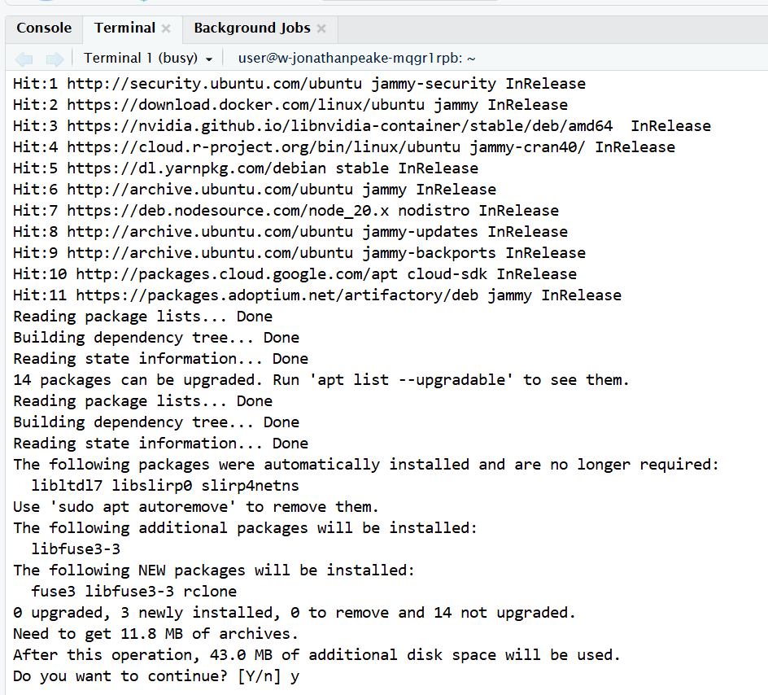\
    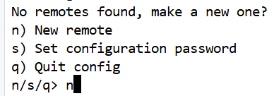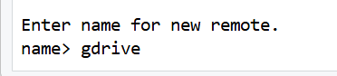

4.  In the next prompt for **Storage**, enter `24` and hit enter.\
    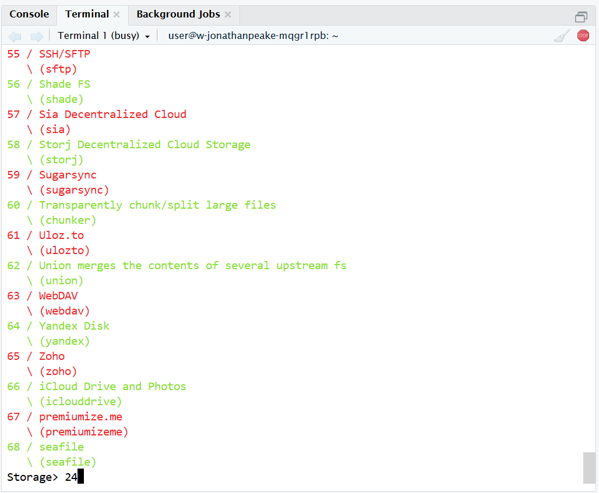

5.  Leave the **client_id** and **client_secret** prompts blank (just enter through them). Enter `1` for **scope** to grant full read-write permissions to your Google Drive.\
    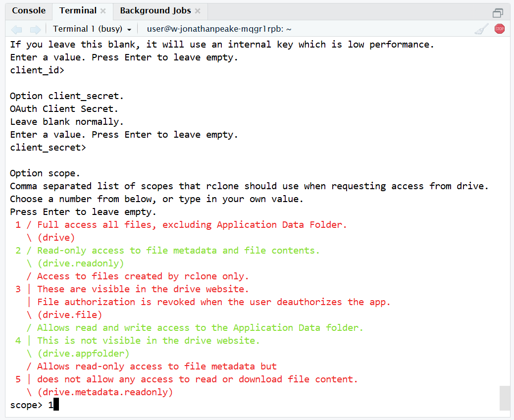

6.  Enter through the **service_account_file** step without entering a value, and enter `n` when prompted to **Edit advanced config?**. Also enter `n` when prompted to **use auto config**.\
    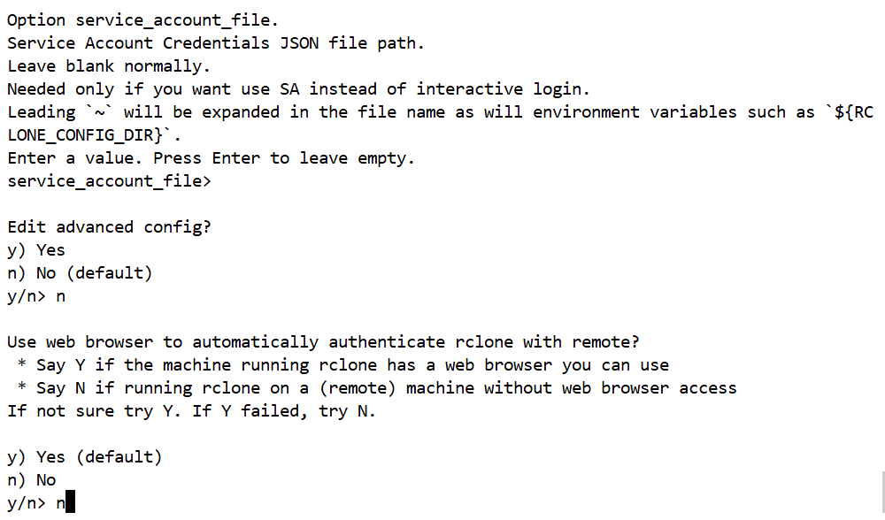

7.  Here is where things get a little tricky. You will also need to have the same version of RClone installed on your local machine. To do this on a Mac or a Windows machine, go to [Rclone downloads](https://rclone.org/downloads/) and download the current version for your operating system. Extract the resulting zip file to a dedicated folder, then open a terminal in that folder.\
    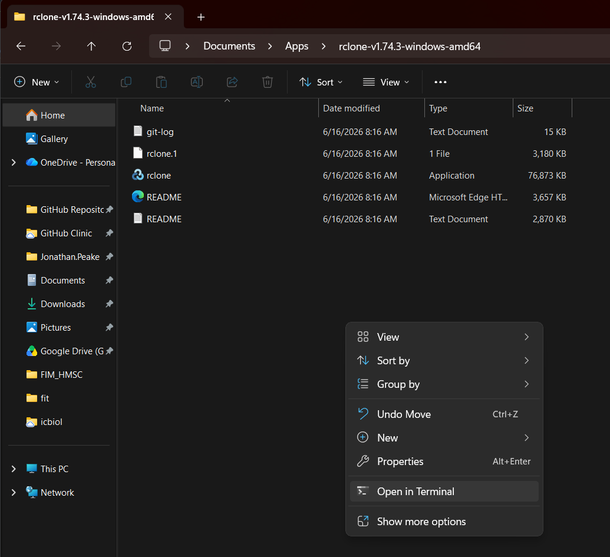

8.  Once you have a terminal open on your local machine, copy the line of code from your workstation into your local terminal and proceed with authorizing through the browser.\
    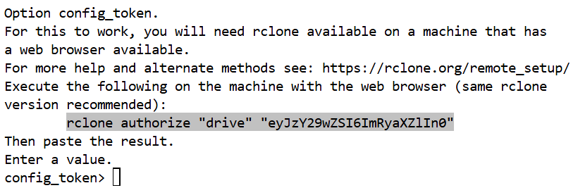\
    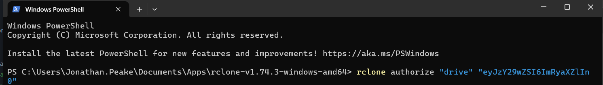

9.  Copy the resulting string of characters from your local terminal into your remote terminal where it says `config_token`.\
    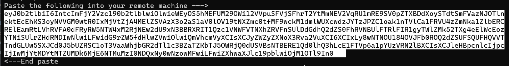\
    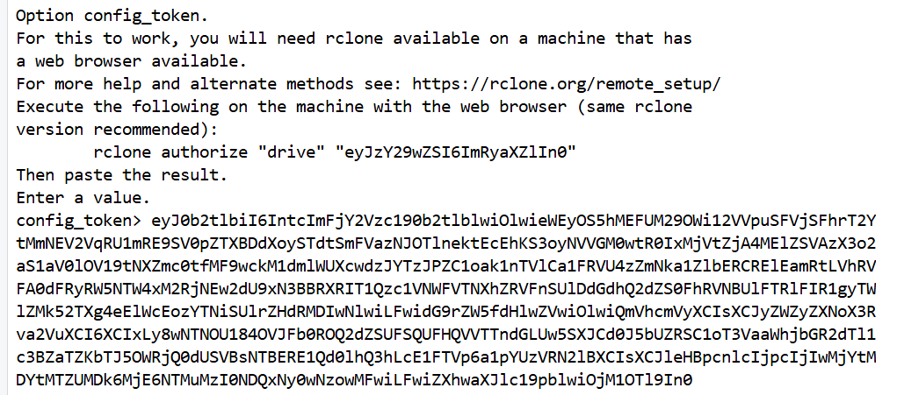

10. Back in your workstation terminal, select `n` when prompted to configure as a Shared Drive. Finally, select `q` to quit the configuration steps.\
    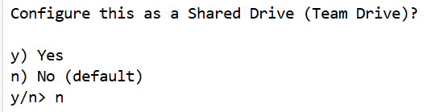\
    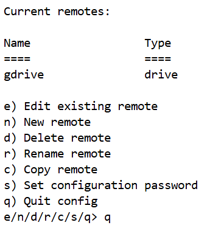

11. Now that your workstation RClone is configured, the last thing you'll need to do is mount your drive folder. Run the following script to mount the drive to the gdrive folder:

```         
rclone mount gdrive: ~/gdrive --vfs-cache-mode writes --daemon --dir-cache-time 72h --vfs-cache-max-age 1h --log-level INFO
```

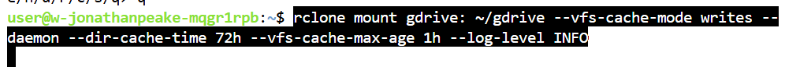

Now when you click in your gdrive folder in RStudio, you should see all of your files and folders from your NOAA Google Drive.\
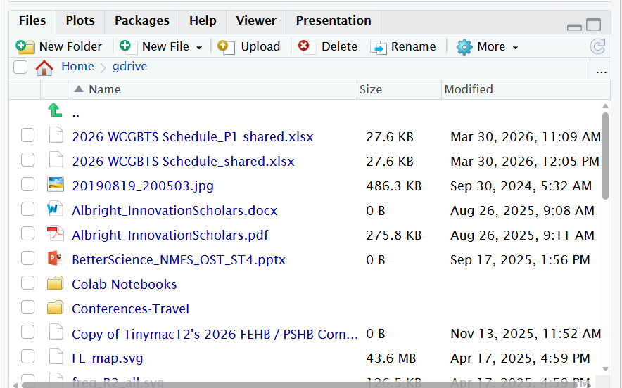

## Access Google Drive files and folders in R using the googledrive package

The previous steps allow you to browse your files in a folder like you would any other folder. But if you need to access files directly through an R script without needing access to all of your files on your Google Drive, the R `googledrive` package is an easier way to load data files directly from your Google Drive into an R environment.

1.  In an RStudio session, install the `googledrive` package using `install.packages("googledrive")`. This is a Tidyverse package that will also install if you run `install.packages("tidyverse")`. Note: remember to change your repository to Posit Package Manager, which uses precompiled binaries to speed things up.\
    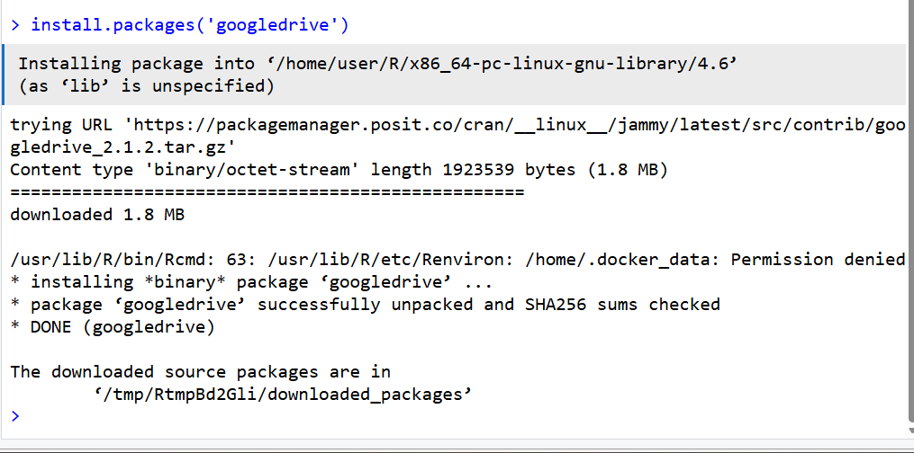

2.  Run the following script to configure the `googledrive` package to work with your Google account. Replace "my.email\@noaa.gov" with your NOAA email. Select 1 to cache your credentials so you don't have to login in the future. This will open a login page where you will authorize your account.

    ```         
    library(googledrive) 
    library(gargle)  
    drive_auth(token = credentials_user_oauth2(   
        scopes = "https://www.googleapis.com/auth/drive",
        email = "my.email@noaa.gov"))  
    ```

    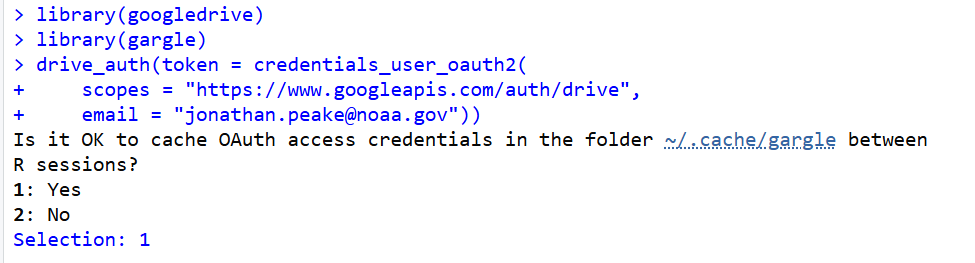\
    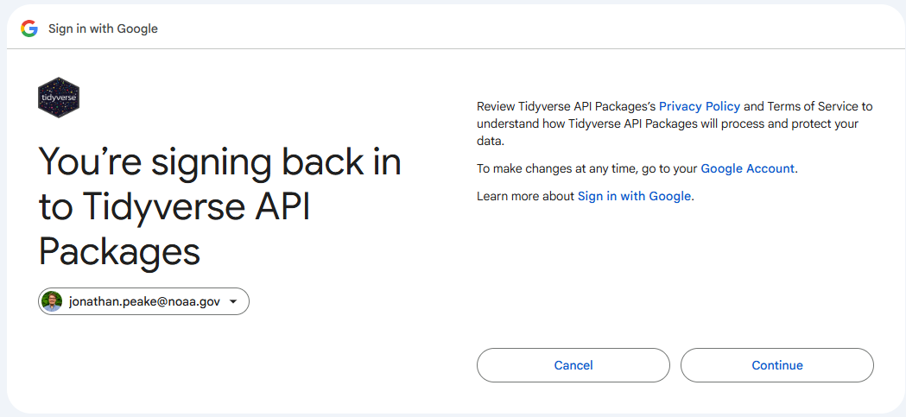

3.  Copy the resulting character string to your clipboard, then paste it into your RStudio console.\
    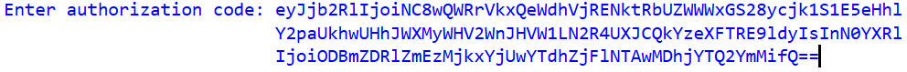

4.  To test that everything was set up correctly, run `drive_find(n=10)` in your RStudio console. If everything was configured correctly, this should list the first 10 files/directories in your google drive.\
    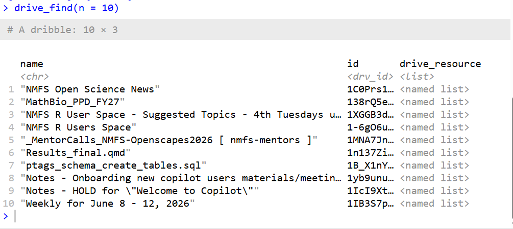