## Aims and Objectives

All [NOAA datasets must be uploaded in the cloud by 2026](https://docs.google.com/presentation/d/18cwiB2f2rVlX3RJIsIB0iaD9u2bMdblZCS8RYcrGDd0/edit?slide=id.p1#slide=id.p1), and all on-premises computing resources (meaning high-performance computing) for NOAA Fisheries are planned to be retired by 2027. [NOAA Fisheries Cloud Program](https://docs.google.com/document/d/1nziPdPULoRWOYQ9WKzISNUgJvANACvfYpFr1z3Ro2Bc/edit?tab=t.0) began a Cloud Compute Accelerator Pilot in early 2025: [Enhancing NOAA Fisheries’ Mission with Google Cloud Workstations](https://docs.google.com/document/d/1u7R5KjfEDYdwYTvO9kU6EyeHfG7dV9TQizIyCn8seO0/edit?tab=t.0). Following the conclusion of this Pilot Program, they compiled [Frequently Asked Questions](https://docs.google.com/document/d/1U1PzGS7G70xsXtD6F6WxkjTSCw7bwNVyZ-YnFyOLOqU/edit?tab=t.0) for pilot participants and new users. Following a successful pilot phase, the NOAA Fisheries Cloud Compute Accelerator is now transitioning to a fully supported production service for Fiscal Year 2026. This enterprise service provides NOAA Fisheries staff with a pre-configured, secure, and web-accessible cloud-based development environment.

Our goal is to accelerate development, enhance collaboration, and optimize costs for compute-intensive tasks like stock assessments, ecosystem modeling, and machine learning applications. In conjunction with the Office of the Chief Information Officer and the Office of Science and Technology, NMFS Open Science is providing a training to help onboard new users to the Google Cloud Workstations platform. Today, we'll be covering the following topics:

- Intro to working in the cloud and how it's different than working on your computer

- Intro to the workstations available through the accelerator program

- Starting up and shutting down a workstation

- Installing packages

- Uploading and downloading files

## Prerequisites: What do I need before this workshop to follow along on my own?

If you have not already requested access to NOAA's Google Cloud Workstations program, complete [this request form](https://apps-st.fisheries.noaa.gov/jira/servicedesk/customer/portal/14) to obtain access. You will need to provide your affiliation (e.g., GARFO, NEFSC, PIRO), primary use case (e.g., Data Analysis, Modeling, Machine Learning), and a brief description of your work. The Fisheries Cloud Program team aims to process requests within 24 hours. You will receive an email with next steps once you have been added to the program.

## Working in the Cloud

<iframe class="slide-deck" src="cloud-slides.html" width="1100" height="650">

</iframe>

## The NMFS Google Workstations Platform

<iframe class="slide-deck" src="workstations-slides.html" width="1100" height="650">

</iframe>

## Tutorial: Getting Started on Google Workstations

1.  Go to the Google Workstations Cloud Console: [Cloud Workstations – Google Cloud console](https://console.cloud.google.com/workstations/list?project=ggn-nmfs-wsent-prod-1)
2.  Click "Create workstation"\
    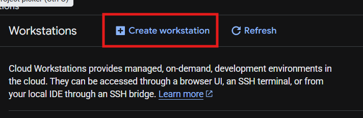
3.  Fill in the Display Name (typically descriptive of your project) and select your Configuration\
    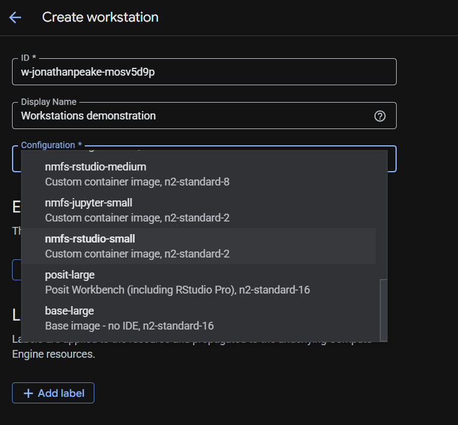
4.  Click the "Create" button to create your workstation\
    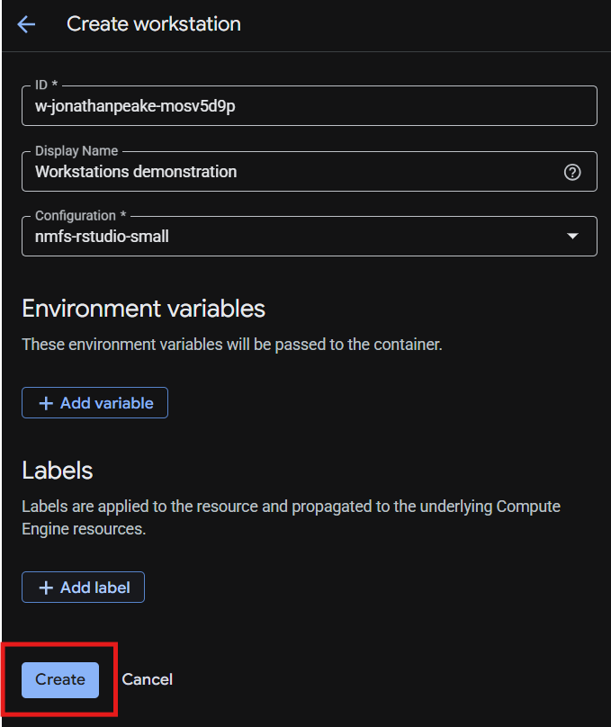
5.  Launch your workstation\
    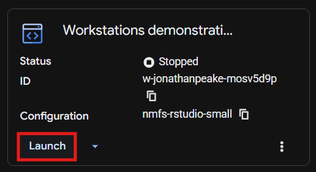
6.  Your workstation will take a while to spin up; you should see a loading screen while you're waiting\
    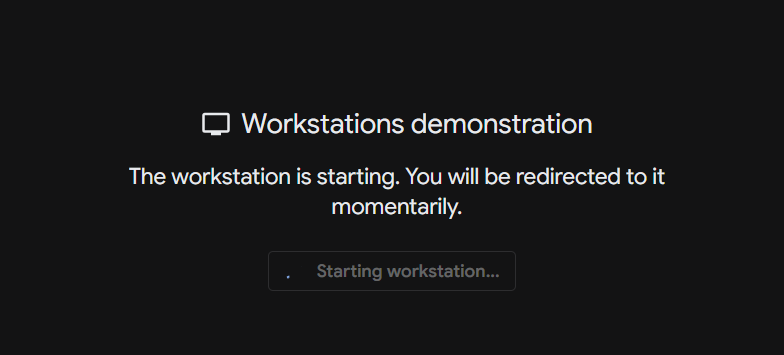
7.  Once your workstation has finished starting up, it will automatically open your virtual environment. For the RStudio configuration, you will see a browser-based version of RStudio with all of the typical features. Similarly, for the Jupyter configuration, you will see a browser-based version of Jupyterlab.\
    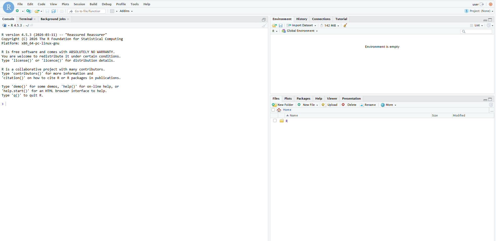
8.  Let's install some R packages. Run the following code in your console to change the default package repository to the Posit Package Manager. Don't forget to restart your R session to lock in the changes to your Rprofile.

``` r
repo_line <- 'options(repos = c(CRAN = "https://packagemanager.posit.co/cran/__linux__/jammy/latest"))'
writeLines(repo_line, "~/.Rprofile")
# Restart R session to lock in Rprofile changes
# Session -> Restart R or Ctrl+Shift+F10
```

9.  Install your favorite package using the standard `install.packages()` command. Make sure your library path is installing in your user Home directory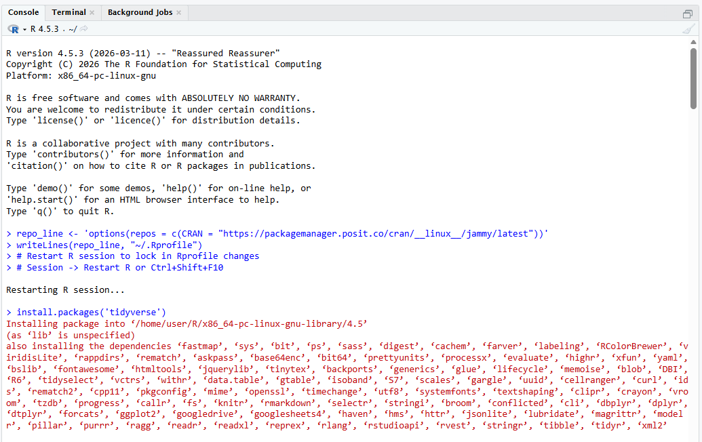
10. Upload a file using the Upload button in the RStudio files tab\
    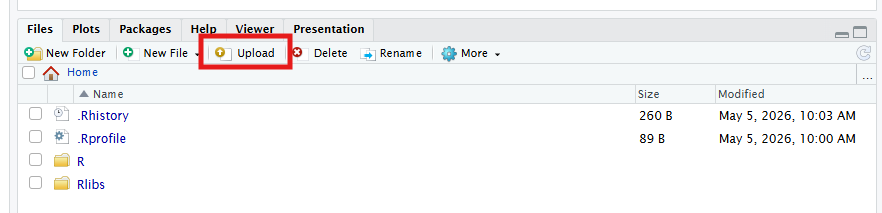
11. Now lets download a file. Create a new R Script with the "New File" button, and save it in your Home directory\
    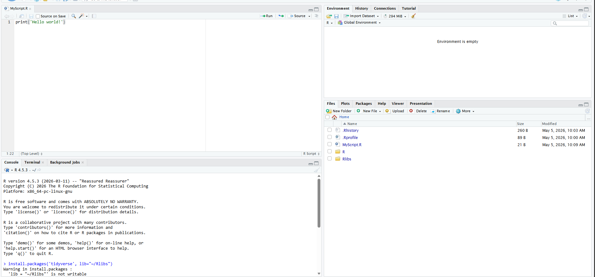
12. In the Files pane, check the box next your file and click the "More" button next with the settings cog icon. Click "Export" to download your file to your local machine.\
    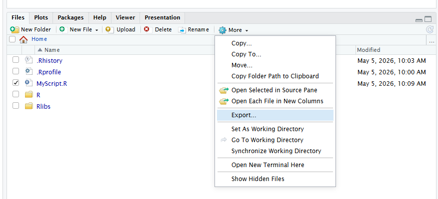
13. If working in the Jupyter configuration, uploading and downloading occurs from the files pane similarly to RStudio.\
    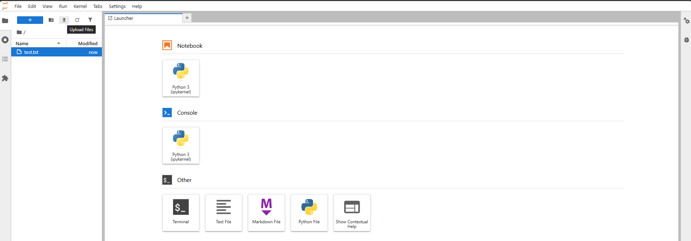\
    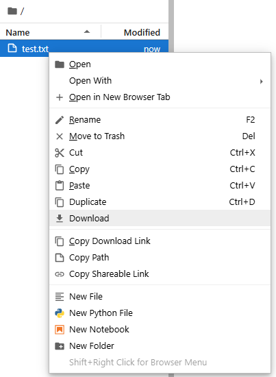
14. Sometimes you will encounter a screen like this. This can happen when launching a Workstation that loads before the configuration is fully set up. Refreshing the page after a few seconds should clear the error.\
    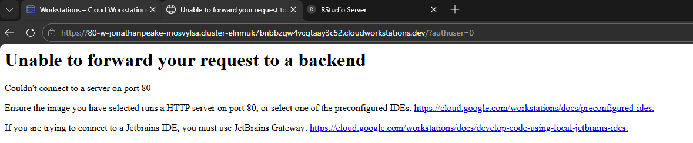